

  

  <h1 align="center">
  LANGUAGE TRANSLATOR  
  USER MANUAL
  </h1>

<ul>
	<li><a href="#installation">Installation</a></li>
	<li><a href="#introduction">Introduction to Application</a></li>
	<li><a href="#translation">Translation</a></li>
	<li><a href="#quiz">Quiz</a></li>
	<li><a href="#menu_options">Menu Options</a>
	  <ul>
		  <li><a href="#hoal">How to change application language?</a></li>
		  <li><a href="#hoaa">How to change application appearance?<a></li>
		  <li><a href="#hqa">How to quit application?</a></li>
	  </ul>
	</li>
	<li><a href="#documentation">Documentation</a></li>
	<li><a href="#privacy_policy">Privacy policy</a></li>
	<li><a href="#contact_us">Contact Us</a></li>
	<li><a href="#references">References</a></li>
</ul>

<article id="installation">

## Installation:

<!-- OL -->
   
   
   

1. Open Google Play Store
2. Search “jhonr1_language_translator” or click <a href="https://play.google.com/store/apps/details?id=jhonr1.bit.language_translator">here</a> and go to step 4.  
3. Select the app  
4. Click on install  

</article>

## Introduction to Application

 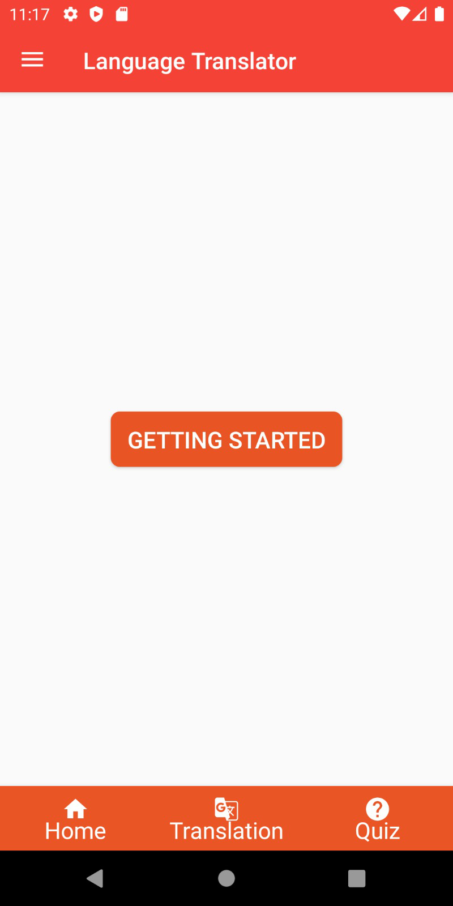
	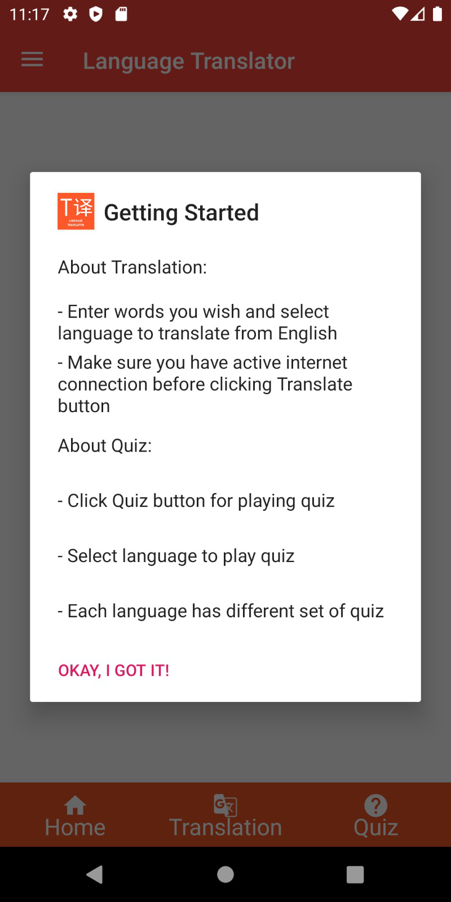

	After installation done, Open the application. you can see Home screen as above. There are 3 menus in the bottom navigation bar and drawer menu on the top left.

1. Home

	-  The GETTING STARTED button click gives you basic information about how to use the application.

2. Translation

	- it helps user to convert sentences or words from English to other language selected on the drop down menu.

3. Quiz

	- Quiz section contains questions for different languages. Each language has different set of questions. 

4. Drawer Menu

	- It provides option to change display language and application appearance (dark mode / day mode).

<article id="translation">

## Translation

 

	Basically translation helps you convert English sentences or words to the selected language. Currently it supports German, Spanish, French and Italian languages. It also provides vocal pronunciation to the translated text.
 

### Translation View

	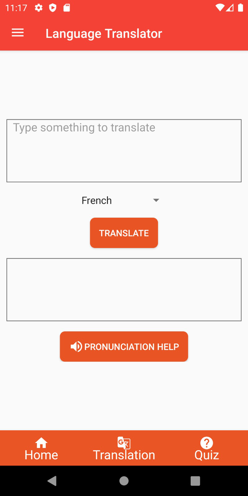
	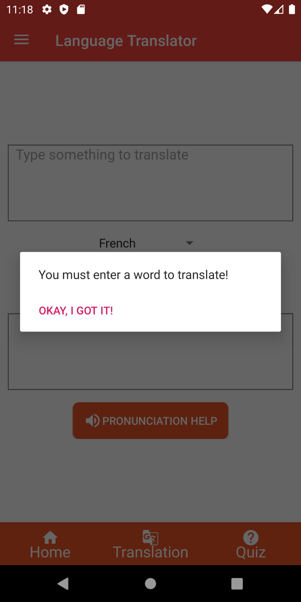
	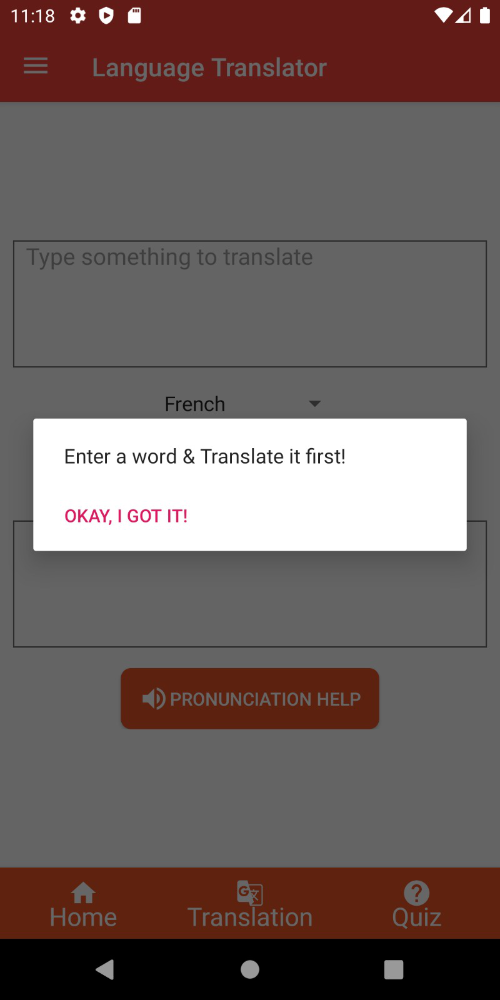

  In Translation section, First textbox provides user to enter English sentences. There is a drop down list which provides option to select the language to convert. Translate button which translates English words to the selected language. If you click "translate" button without word in input textbox, then it throws error message as "You must enter a word to translate". 

  In Second Textbox, you can see the output of translated sentence or word. The "Pronunciation Help" button which pronunce the translated words for you. if there is no word in translated textbox, then it will show you message "Enter word & translate it first!".

</article>

<article id="quiz">

## Quiz

	In Quiz, there are 3 sections select language for the quiz, play quiz and results section.

### Quiz View

	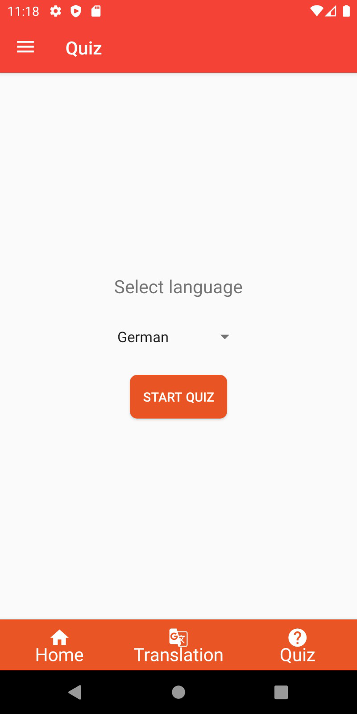

	Above image shows language selection for playing quiz. "START QUIZ" button takes you to play quiz.

### Quiz questions and options

	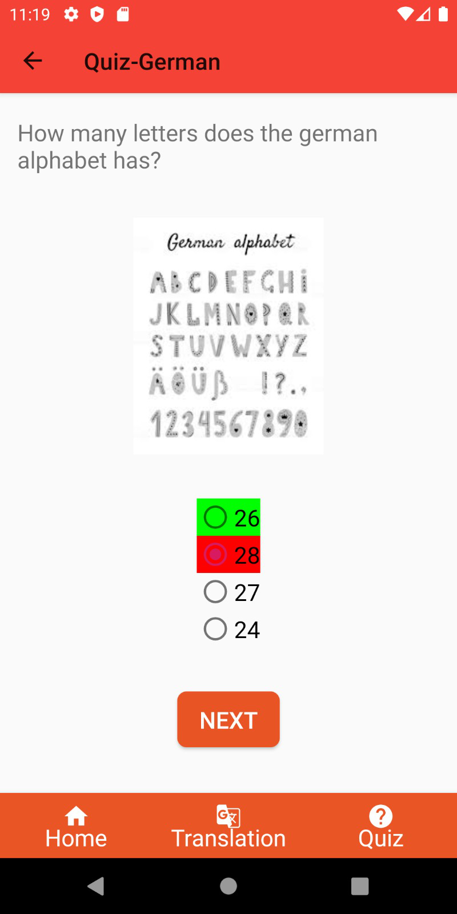
	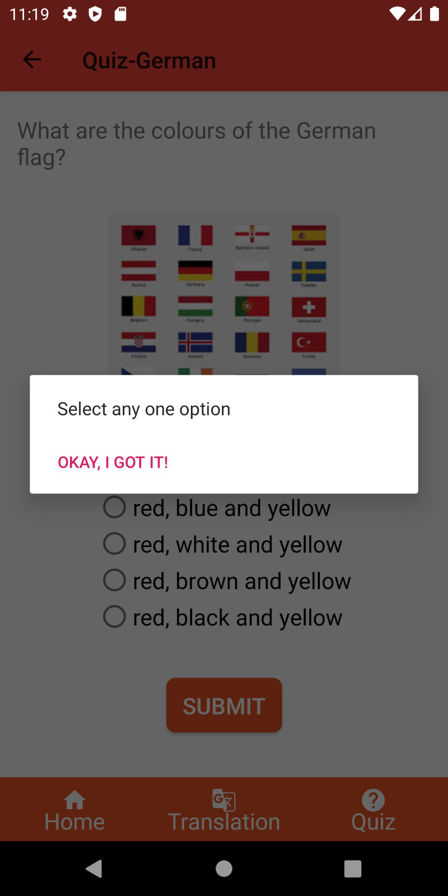
	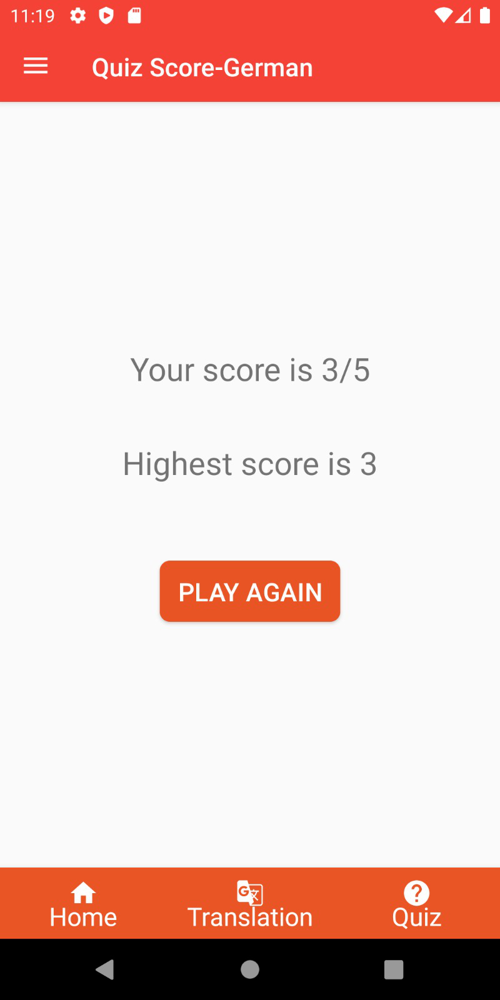

	Question section contains question, image, possible answers and a button to submit / to load next question.

	If you try to skip question without giving answer, it will show you the message "Select Any one option".

	user will be notified correct answer with green color and wrong answer with red color. Additionally there will be a toast message appear which tells information about the answer irrespective of the right or wrong answer.

	At the end of quiz, final score and highest score of quiz will be displayed. The highest score is unique for each language.

	"PLAY AGAIN" takes you to play the quiz again.

</article>

## Menu Options

	This section includes settings related to application's language and appearance.

### How to change application language

	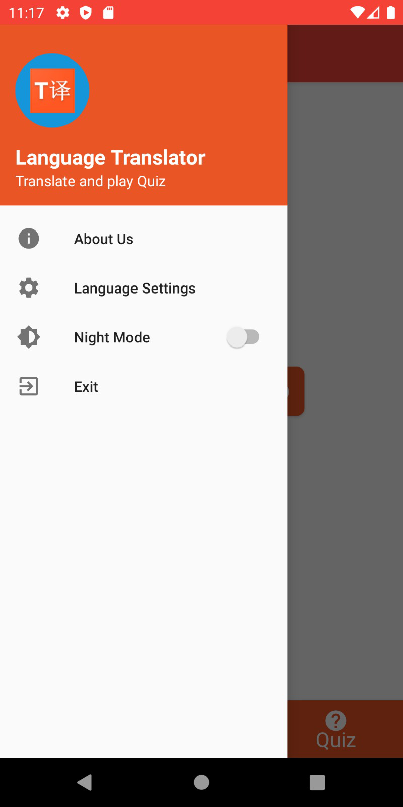
	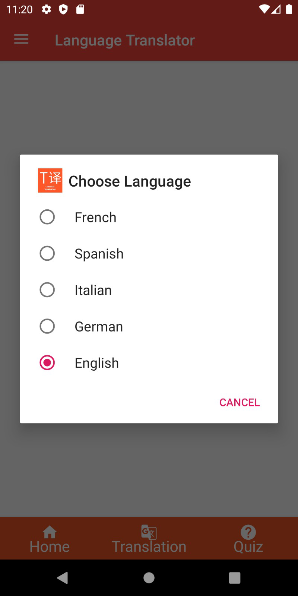

1. Open the left drawer menu.
2. Click on Language Settings.
3. Choose the language from the list.

	Application language is changed for all the sections.

### How to change application Appearance

	Application provides night mode ON/OFF for better visual effects .

	
	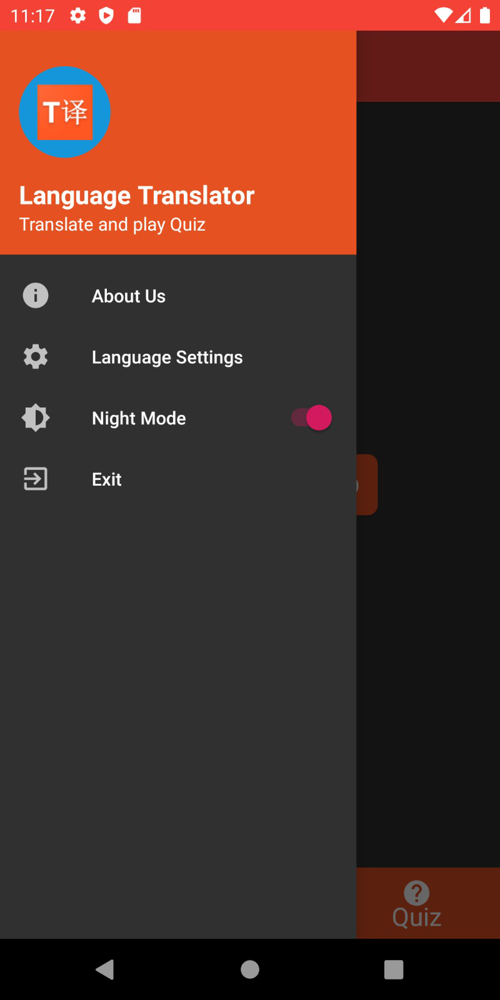
	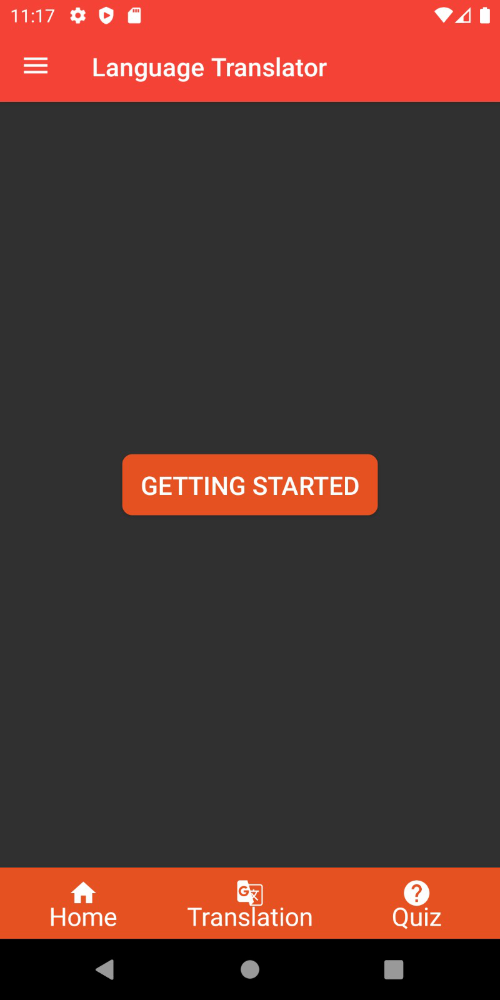

1. Open the left drawer menu.
2. Turn on night mode.
3. Application theme changed to dark.

### How to quit application

	
	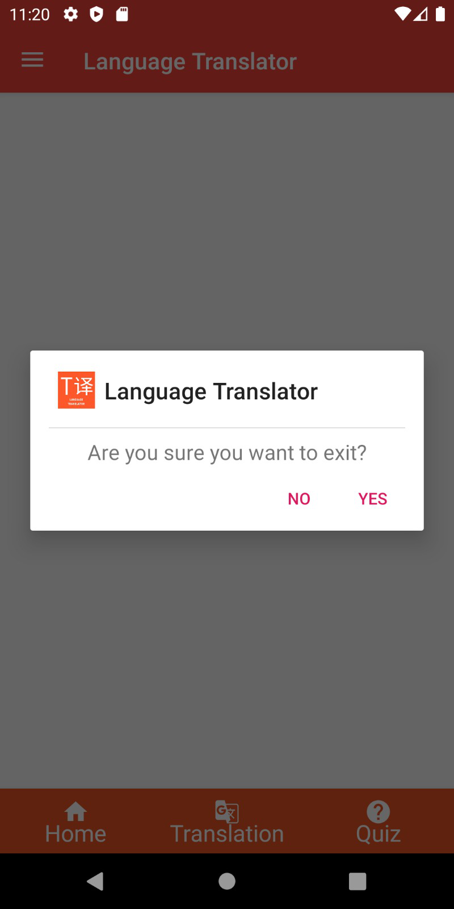

1. Open the left drawer menu.
2. Click on Exit and you will see confirmation message.
3. Click on yes.
4. Application is closed.
5. Application can also be closed via back button.

### About us

	
	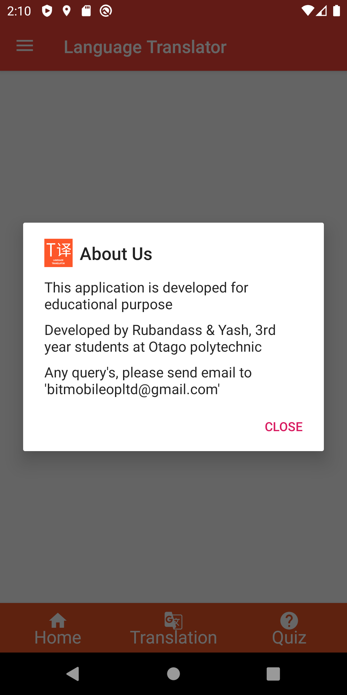

To open about us

1. Open left drawer menu
2. Click on about us
3. you could see the developer details and contact details.

<article id="documentation">

## Documentation:

	Click <a href="./Language-translator/app/build/javadoc/app/index.md">here</a> to view full documentation of the project.

</article>

## Privacy policy:

	Rubandass & Yash built the [Language translator] app as a Free app. This SERVICE is provided by Rubandass & Yash at no cost and is intended for use as is. This page is used to inform visitors regarding my policies with the collection, use, and disclosure of Personal Information if anyone decided to use my Service. If you choose to use my Service, then you agree to the collection and use of information in relation to this policy. The Personal Information that I collect is used for providing and improving the Service. I will not use or share your information with anyone except as described in this Privacy Policy. The terms used in this Privacy Policy have the same meanings as in our Terms and Conditions, which is accessible at [Language translator] unless otherwise defined in this Privacy Policy.

### Information Collection and Use

	For a better experience, while using our Service, I may require you to provide us with certain personally identifiable information. The information that I request will be retained on your device and is not collected by me in any way. The app does use third party services that may collect information used to identify you. Link to privacy policy of third party service providers used by the app.

### Google Play Services

#### Log Data

	I want to inform you that whenever you use my Service, in a case of an error in the app I collect data and information (through third party products) on your phone called Log Data. This Log Data may include information such as your device Internet Protocol (“IP”) address, device name, operating system version, the configuration of the app when utilizing my Service, the time and date of your use of the Service, and other statistics.

#### Cookies

	Cookies are files with a small amount of data that are commonly used as anonymous unique identifiers. These are sent to your browser from the websites that you visit and are stored on your device's internal memory. This Service does not use these “cookies” explicitly. However, the app may use third party code and libraries that use “cookies” to collect information and improve their services. You have the option to either accept or refuse these cookies and know when a cookie is being sent to your device. If you choose to refuse our cookies, you may not be able to use some portions of this Service.

### Service Providers

	I may employ third-party companies and individuals due to the following reasons:
	To facilitate our Service;
	To provide the Service on our behalf;
	To perform Service-related services; or
	To assist us in analyzing how our Service is used.
	I want to inform users of this Service that these third parties have access to your Personal Information. The reason is to perform the tasks assigned to them on our behalf. However, they are obligated not to disclose or use the information for any other purpose.

### Security

	I value your trust in providing us your Personal Information, thus we are striving to use commercially acceptable means of protecting it. But remember that no method of transmission over the internet, or method of electronic storage is 100% secure and reliable, and I cannot guarantee its absolute security.

### Links to Other Sites

	This Service may contain links to other sites. If you click on a third-party link, you will be directed to that site. Note that these external sites are not operated by me. Therefore, I strongly advise you to review the Privacy Policy of these websites. I have no control over and assume no responsibility for the content, privacy policies, or practices of any third-party sites or services.	I may update our Privacy Policy from time to time. Thus, you are advised to review this page periodically for any changes. I will notify you of any changes by posting the new Privacy Policy on this page. This policy is effective as of 2020-05-01

	
## Contact Us

	If you have any questions or suggestions about my Privacy Policy, do not hesitate to contact me at [bitmobileopltd@gmail.com].
	This privacy policy page was created at privacypolicytemplate.net and modified/generated by App Privacy Policy Generator

<article id="references">
	
## References

	Privacy policy page was created at <a href="https://www.privacypolicytemplate.net/">App Privacy Policy Generator</a>.

	We have used <a href="https://tech.yandex.com/translate/">Yandex API</a> services for word translation.

	We have used <a href="https://www.canva.com/">Canva.com</a> services for logo creation.

	We have used <a href="https://plugins.gradle.org/plugin/org.jetbrains.dokka-android">Dokka</a> for creating Kotlin documentation.

</article>
